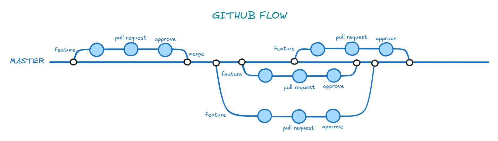
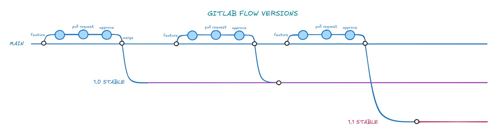

# WORKFLOW

Ещё одно понятие, которое входит в пресловутый git. Девопсу очень важно понимать, как работает команда разработчиков.
Что входит в понятие workflow: 
- Какая модель ветвления 
- Как происходит процесс релизов 
- Где, как и когда включается CI/CD 

В этом посте разберем разные стратегии ветвления.

## GITHUB FLOW
Это самая простая стратегия ветвления, которая подходит для небольших команд и проектов с частыми релизами.

Основные принципы:

- Вся разработка начинается с создания отдельной ветки от master (main).
- Каждая новая задача (feature, bugfix, hotfix) реализуется в своей ветке.
- После завершения работы создаётся Pull Request (PR) для ревью.
- После аппрува PR ветка сливается обратно в master.
- Любой код в master должен быть готов к деплою.
- После слияния изменений в master обычно сразу           происходит деплой на продакшен.
  

### То есть процесс разработки выглядит следующим образом:
Отбранчуется ветка от мастера, там ведется нужная разработка, когда разработка завершена → Pull request, ревью, апрув, мердж в мастер и деплой.

За счет своей простоты этот флоу лучше всех остальных для полного автоматического CI/CD. Процесс максимально прозрачный и понятный. Но есть и минусы:

- Не подходит для поддержки нескольких версий продукта.
- Нет отдельной ветки со стабильной версией — возможны баги в проде.
# GitFlow
Классическая, очень популярная и более сложная стратегия. Подходит для крупных проектов с релизными циклами и необходимостью поддержки нескольких версий.

### Структура ветвления:

- master (main) всегда содержит только стабильный и релизный код.
- develop - основная ветка для интеграции новых фичей перед релизом.
- feature/* ветки для разработки новых фичей, создаются от develop, после завершения сливаются обратно в develop.
- release/* ветки для подготовки релиза, создаются от develop, после релиза сливаются в master и develop.
- hotfix/* для срочных исправлений в проде, создаются от master , после фикса сливаются в master и develop.

.jpg)

### А вот так выглядит процесс разработки:
1. **Создание фичи**
- От основной ветки разработки (develop) создаётся отдельная ветка для новой фичи
- Вся работа над задачей ведётся только в этой ветке.
1. **Завершение работы над фичей**
- Когда завершили работу, фича-ветка сливается обратно в develop (обычно через Merge Request/Pull Request и ревью)
1. **Деплой в dev-окружение**
- После слияния фичи в develop обычно автоматически запускается CI/CD пайплайн для деплоя на dev-сервер.
- Изменения тестируются в dev-окружении.
1. **Подготовка релиза**
- Когда накопилось достаточно изменений, создаётся ветка релиза
- В релизной ветке фиксируются баги, обновляются версии, документация и т.д.
1. **Деплой релиза в dev/stage**
- Ветка release/x.y.z деплоится на stage/dev для финального тестирования.
- Вносятся последние правки, багфиксы коммитятся прямо в релизную ветку.
1. **Выпуск релиза (деплой в прод)**
- Если протестировали и всё ок - релизная ветка сливается в master (main):
- Также изменения из релизной ветки вливаются обратно в develop, чтобы не потерять фиксы
- Релиз тегируется (условно 1.0.1)
- CI/CD деплоит код из master на прод.
  
Этот подход к ветвлению обеспечивает четкое разделение стадий (фича, дев, релиз, мастер), на каждом этапе всё безопасно тестируется, в случае чего легко можно сделать откат, плюс есть возможность иметь несколько версий приложения. Но, здесь CI/CD уже не такой простой, как в GitHub flow, так как веток больше, есть разные окружения, тестирование в них и сборки релизов.
# GitLab FLOW
Это нечто среднее, между github flow и gitflow. Стратегия вариативная, можно подстроить под разные процессы. Можно сказать взяли лучшее из двух: простоту и структурность.

### Ключевые особенности:
- Основная ветка (main или master) с продакшен-кодом.
- Для новых задач создаются feature-ветки, которые после ревью вливаются в master.
- Возможны дополнительные ветки для разных окружений: staging, production, pre-production.
- Можно использовать issue-трекинг и merge requests для управления задачами.
- Опционально можно внедрить релизные ветки для версионирования

.jpg)

### У GitLab Flow есть две основные вариации:
- Environment branches, то есть отдельные ветки для разных сред (тот же staging). Код последовательно проходит через эти ветки по мере тестирования и релиза.
- Release branches. Этот вариант нужен для поддержки нескольких версий продукта. Можно создавать ветки v1, v2 и т.д., в которые попадают только нужные изменения (например, багфиксы через cherry-pick).
- 
Этот флоу можно адаптировать под любой процесс, он легко интегрируется с CI/CD. Самое главное - договорённости внутри команды по правилам ветвления и релизов. Это всё тщательно описывается, чтобы все понимали с чем и как они работают.
### Отдельно рассмотрим GitLab flow с версионированием.

**Работает это так:**

- Для каждой поддерживаемой версии создаётся отдельная ветка (v1, v2 и т.д.).
- Новые фичи и багфиксы сначала попадают в основную ветку разработки (master или develop), затем нужные изменения cherry-pick'ом переносятся в ветки соответствующих версий.
- Подход позволяет исправлять баги в старых версиях, не внедряя туда новые фичи.

Сложность заключается именно в поддержании релизов и долгосрочной поддержкой нескольких версий, всё надо тщательно перепроверять при переносе изменений между ветками версий

# Trunk-based Development
Trunk в переводе с английского в нашем контексте - ствол. На картинке видно, почему он имеет именно такое название.

Основное тут у нас - частые и маленькие коммиты в одну общую ветку trunk (или master)

.jpg)

**Особенности:**

- Все разработчики работают с одной основной веткой, feature-ветки живут не дольше пары дней (в идеальной картине - не более 24 часов)
- Ветки быстро сливаются обратно в trunk
- CI/CD обложен огромной кучей автотестов. И если другие стратегии хоть как-то можно представить без автоматического CI/CD (и то с натяжкой), то здесь это просто невозможно
- Если нужны релизные ветки, они создаются только для стабилизации и поддержки релиза, а не для долгой разработки

**Самый главный плюс** - максимальная скорость релизов. Из минусов (или особенностей) - здесь должен быть максимально высокий уровень автоматического тестирования. И этот флоу не подходит для продуктов, где надо поддерживать несколько версий.